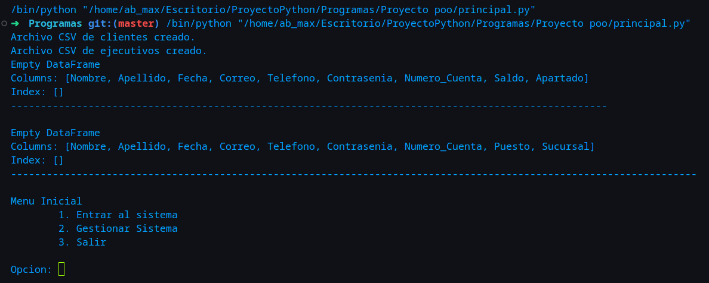
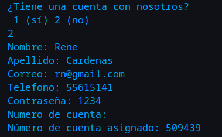
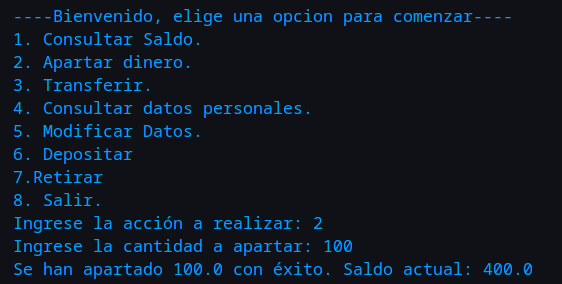

# Instrucciones para la Ejecución del Código

## Configuración Inicial

Antes de ejecutar el código, asegúrate de seguir estos pasos iniciales:

### Instalación de Dependencias

pip install pandas datetime

## Ejecución del Código

Después de completar la configuración inicial, el código te guiará a través de menús explicativos. Sigue las opciones de menú para realizar las acciones deseadas de manera intuitiva.

**Nota:** Si es la primera vez que ejecutas el código, el proceso de configuración inicial es crucial para el correcto funcionamiento del programa. Sigue las instrucciones proporcionadas en los menús para garantizar una ejecución exitosa.

## Acceso a los Archivos

Una vez que hayas ejecutado el código, podrás acceder a los archivos generados en la ruta de inicio del usuario actual. Los archivos incluirán:

- registro_clientes.csv: Información de los clientes.
- registro_ejecutivos.csv: Información de los ejecutivos.

¡Listo! Ahora estás listo para utilizar el sistema de gestión según tus necesidades.

## Variables de entrada

Al iniciar por primera vez el programa, veremos que los CSV's estarán vacíos. Veremos el menú inicial.

Para comenzar crearemos a un usuario. Para la creación de un usuario ingreseramos al sistema. En el menú inicial colocaremos:

- **1**
- **2**
- **Arturo**
- **Mercado**
- **<am@gmail.com>**
- **55111213**
- **calculo3**
- *¡Importante:* **Presiona enter para generar un número de usuario aleatorio**

Ejecutamos otra vez el programa y a continuación crearemos otro usuario para simular una interacción entre individuos de un mismo banco. Ingresaremos

- **1**
- **2**
- **Rene**
- **Cardenas**
- **<rn@gmail.com>**
- **55615141**
- **1234**
- *¡Importante:* **Presiona enter para generar un número de usuario aleatorio**

**Nota:** el número de cuenta se imprimirá en la pantalla.
Por su seguridad deberá cerrar la sesión para que los usuarios se carguen en la base de datos. El Administrador automático verificará que su cuenta esté de manera integra.
Antes de continuar, deberemos volver a ejecutar el script de *principal.py*. Ahora ingresaremos al sistema para probar los menús.
Crearemos un administrador para manejar el flujo del programa.

A continuación ingresaremos los siguientes comandos:

- **2**
- **2**
- **Juan**
- **Escutia**
- **<426913@unam.mx>**
- **55666689**
- **sandia**
- *¡Importante:* **Presiona enter para generar un número de usuario aleatorio**
- **Admin**
- **Naucalpan**

Con esto habremos generado un administrador que podrá ingresar al menú correspondiente.

***Urgente:*** Al igual que con los usuarios, tendremos que esperar a que la base de datos se actualice. Cerraremos el script y lo volveremos a ejecutar.
Simplemente presione 3:

- **3**

Tendremos que abrir el script nuevamente.
Para ejemplificar las transiciciones financieras usaremos un usuario ya creado con el cual asignaremos dinero a un cliente. Posteriormente haremos una transferencia entre dos usuarios, siendo un caso financiero real.
Ingresaremos como Arturo.

- **1**
- **1**
- En nuestro caso ingresaremos: **291303**
- **calculo3**
- **6**
- **500**

Apartaremos $100:

- **2**
- **100**

Transferiremos $200 a la cuenta de René:

- **3**
- En nuestro caso usaremos: **509439**

Ahora consultaremos nuestro saldo:

- **1**

Vemos que todo es correcto.

Saldremos e ingresaremos a la cuenta de Administrador:

- **8**
- En nuestro caso es: **722328**
- **sandia**

Veremos los estados de cuenta con:

- **3**

El programa tiene más funcionalidades, el usuario podrá jugar con el programa cuanto quiera.
