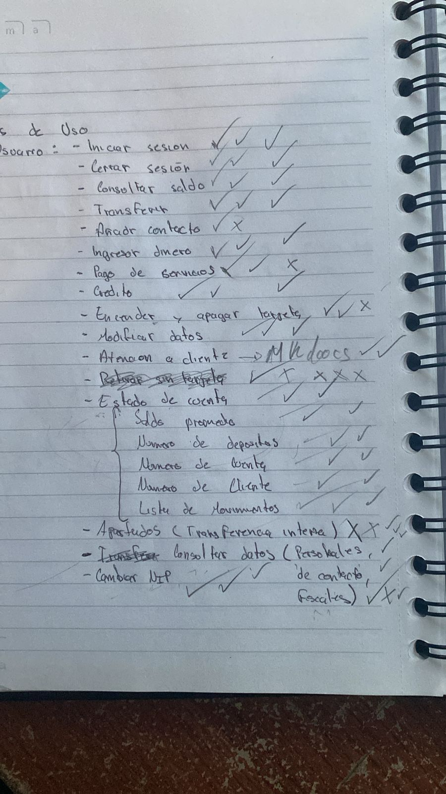
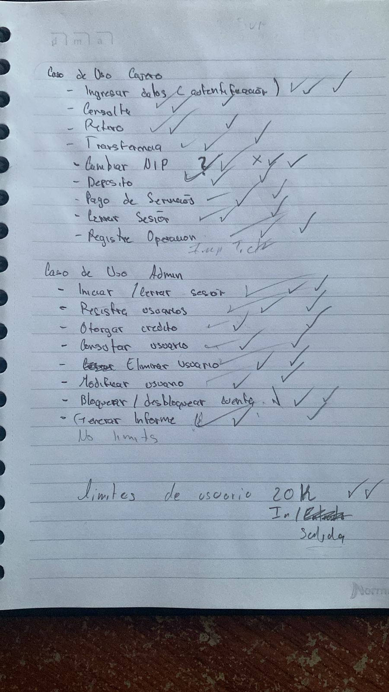
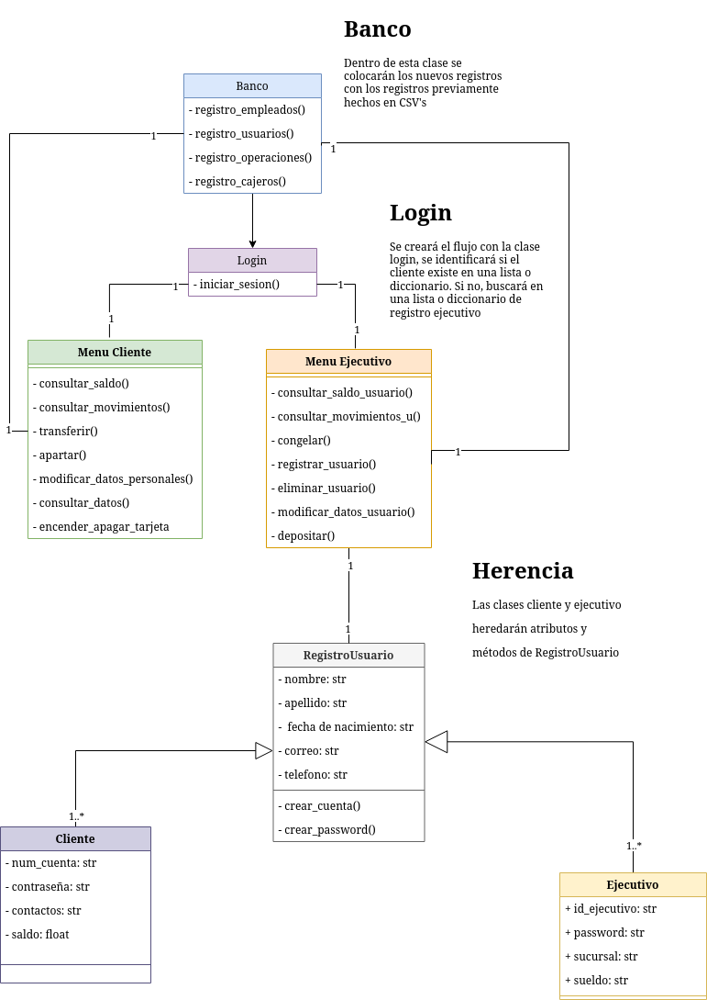
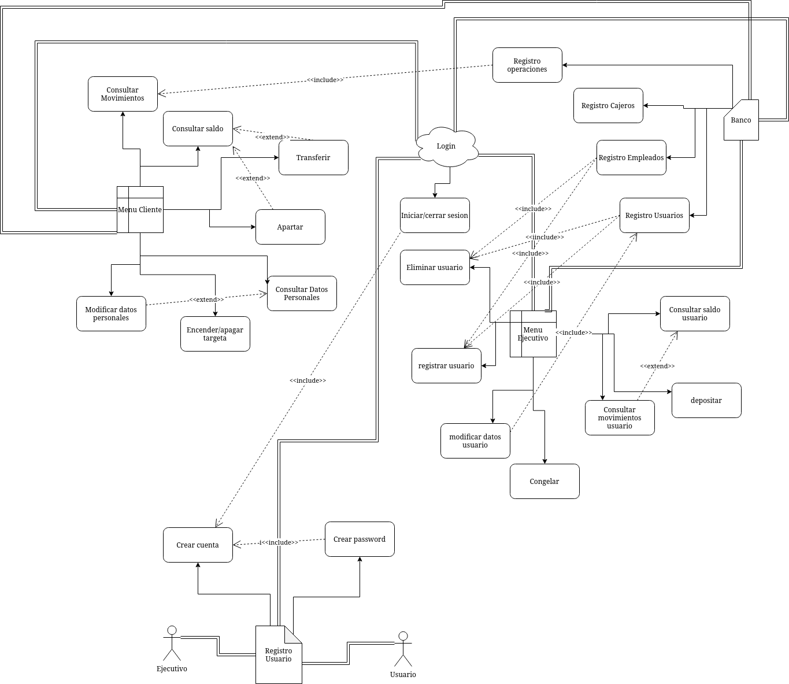
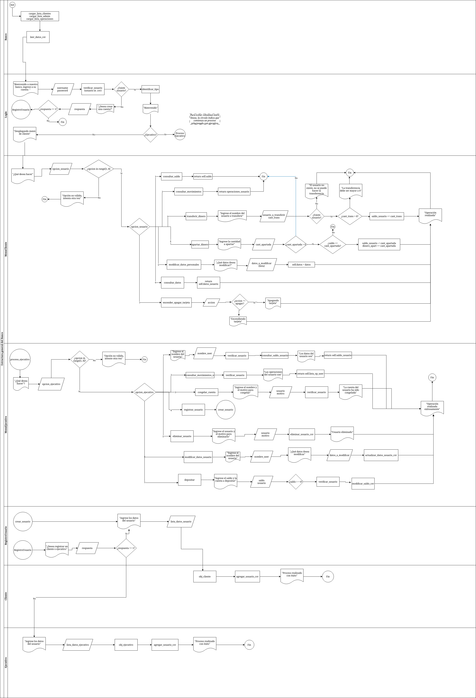

# Banco Toscos Inc

Para una documentación más amplia, véase [Documentación profesional del Banco](./algo.pdf)

## Desarrollo del proyecto

El desarrollo del proyecto constó de cuatro fases:

- La elección de los componentes funamentales de un banco.
- Inicio de la diagramación.
- Scripts de **Python**
- Documentación del proyecto

## Componentes de un banco

En una sesión presencial en la Facultad, Héctor y Jorge presentaron sus sugerencias sobre los componentes fundamentales de un banco debido a que cuentan con más experiencias con los mismos.

## Inicio de la diagramación

Basado en las ideas anteriores, Alexis presentó un diagrama de clases tomando los componentes fundamentales.

Posteriormente Jorge hizo un diagrama de clases mejorado, y por decisión unánime se acordó trabajar sobre ese diagrama.

Aunado a eso, Vilchis presentó un diagrama de casos de uso que, tras algunas modificaciones, terminó así

Por último, se presenta el diagrama de procesos hecho por Alexis.

Debido a que los diagramas son algo grandes, la calidad de los mismos está disminuida. Para una mejor vista de los diagramas véase: [Clases HD](./imagenes/diagrama_clases_definitivo.drawio.png), [Casos de uso HD](./imagenes/diagrama_caso_de_uso.drawio.png) y [Procesos HD](./imagenes/procesos_definitivo.drawio.png)

## Scripts en Python

Basado en los diagramas vistos anteriormente, se registraron ocho scripts de **Python**. El flujo del programa corre sobre el archivo **principal.py** (sic). Para una mayor documentación sobre cómo usar el script, véase [Documentación de uso](./Instrucciones.md)

## Documentación

El documento de Latex estuvo a cargo de Arturo, experto en Latex.
La instrucciones de uso del programa estuvieron a cargo del QA.
El documento Mkdocs estuvo a carga de Alexis.
En la presentación del proyecto colaboraron todos los integrantes del mismo.
